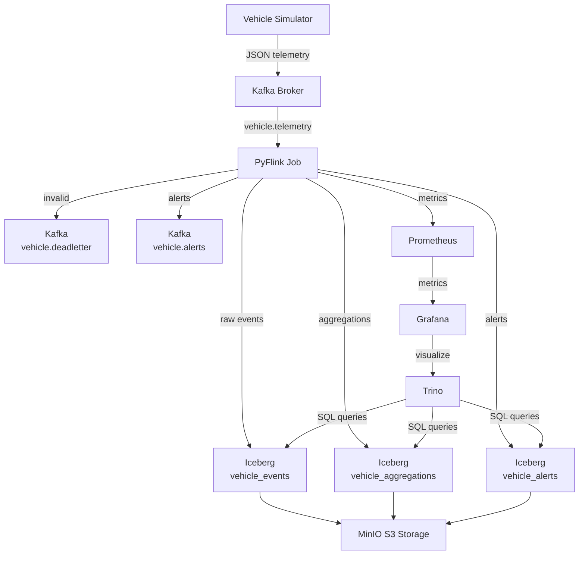
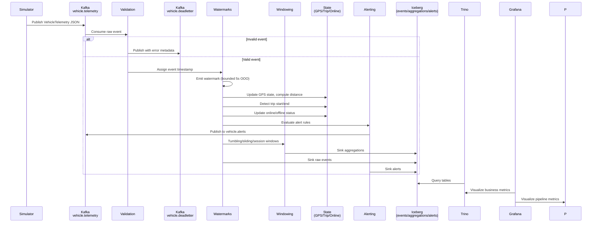

========================================================================
AI CODING PROMPT — Production-Grade Streaming Lakehouse
========================================================================

You are a Senior Software Engineer implementing an atomic task
for a production-grade streaming data platform.

DO NOT modify PROJECT_STATE.md.
DO NOT implement future tasks.
DO NOT add nice-to-have features.

------------------------------------------------------------------------
SECTION 1: CURRENT TASK CONTEXT
------------------------------------------------------------------------

# Working Context

> Auto-generated from PROJECT_STATE.md

---

## Task

M1-E1-T01 — Create `.env` Environment File

## Acceptance Criteria

All services reference variables from `.env`; No hardcoded secrets in `docker-compose.yml`; `source .env && echo $KAFKA_PORT` returns expected value

## Dependencies

None

## Branch

N/A

## Relevant Files

`.env`

## Relevant Architecture Decisions

| Decision ID | Date | Decision | Reason | Impact |
|-------------|------|----------|--------|--------|
| AD-001 | 2026-07-19 | Kafka before Flink | Events must land in Kafka before Flink consumes them; the simulator is independent of the processor | Decouples ingestion from processing; enables replay |
| AD-002 | 2026-07-19 | Event Time over Processing Time | Timestamps are extracted from payload `timestamp` fields, not wall-clock time, to handle out-of-order and late events correctly | Correct semantics for late and out-of-order data |
| AD-003 | 2026-07-19 | Watermarks | Bounded out-of-orderness of 5 seconds with 30-second idle timeout | Balances latency and correctness |
| AD-004 | 2026-07-19 | Dead Letter Queue | Invalid records are routed to `vehicle.deadletter` rather than dropped, preserving auditability | Preserves invalid data for debugging; prevents silent data loss |
| AD-005 | 2026-07-19 | Exactly-Once Semantics | Enabled via Flink checkpointing, Kafka transactional producers, and Iceberg two-phase commit sink | Guarantees no duplicates and no data loss |
| AD-006 | 2026-07-19 | Iceberg as Lakehouse Format | Chosen for schema evolution, time travel, snapshot isolation, and hidden partitioning without full rewrites | Enables analytics without locking; supports historical queries |
| AD-007 | 2026-07-19 | Docker Compose for Local Deployment | All services containerized for reproducibility; no cloud dependencies | Simplifies onboarding; eliminates cloud costs for development |
| AD-008 | 2026-07-19 | RocksDB State Backend | Supports large state, incremental checkpoints, and local recovery | Enables stateful processing at scale |
| AD-009 | 2026-07-19 | Incremental Checkpointing | Checkpoint interval 30 seconds; incremental to minimize I/O | Reduces checkpoint overhead and storage costs |
| AD-010 | 2026-07-19 | REST Catalog for Iceberg | Provides a standard metadata interface shared by Flink and Trino | Unifies catalog access across compute engines |
| AD-011 | 2026-07-19 | MinIO as Object Storage | S3-compatible API for Iceberg warehouse without cloud lock-in | Cost-free local development; cloud-agnostic design |
| AD-012 | 2026-07-19 | Partitioning Strategy | Time-based partitioning (`days(event_time)`) for all Iceberg tables to optimize time-range queries | Improves query performance for time-series analytics |
| AD-013 | 2026-07-19 | Alert Deduplication | Same rule + vehicle alerts suppressed within a 1-minute window using Flink state | Prevents alert spam and reduces noise |
| AD-014 | 2026-07-19 | State TTL | GPS state 1 hour, alert dedup state 10 minutes, trip state 24 hours | Prevents unbounded state growth |
| AD-015 | 2026-07-19 | Auto-Provisioning | Grafana datasources and dashboards auto-load from provisioning directories | Eliminates manual setup on every startup |
| AD-016 | 2026-07-19 | Prometheus Reporter | Flink metrics exposed directly to Prometheus without PushGateway | Simplifies metrics pipeline; reduces infrastructure |

------------------------------------------------------------------------
SECTION 2: PROJECT ARCHITECTURE & DATA CONTRACTS
------------------------------------------------------------------------

Read and internalize the following architecture context before
implementing. Respect all data contracts, naming conventions,
and technology decisions.

# Project Summary

A production-inspired streaming data platform built entirely with open-source technologies running locally via Docker Compose. It ingests vehicle telemetry from a configurable simulator, processes streams in real time using PyFlink with event-time semantics and stateful operators, persists results into Apache Iceberg tables backed by MinIO object storage, and exposes SQL analytics through Trino. Operational health is monitored via Grafana dashboards fed by Prometheus metrics. The project demonstrates stateful stream processing, watermarks, windowing, exactly-once semantics, checkpointing, schema evolution, time travel, dead-letter queues, and failure recovery — going far beyond typical producer-consumer portfolio projects.

# Architecture Overview

## Vehicle Simulator
- **Purpose:** Generate continuous, realistic vehicle telemetry for demonstration and testing.
- **Inputs:** Configuration from environment variables (vehicle count, TPS, duplicate probability, out-of-order probability).
- **Outputs:** JSON events to Kafka topic `vehicle.telemetry`.
- **Responsibilities:** Simulate GPS movement, engine metrics, intentional duplicates, out-of-order events, and random delays.

## Kafka Broker
- **Purpose:** Durable message broker and event log.
- **Inputs:** Events from Vehicle Simulator; alerts from PyFlink.
- **Outputs:** Event streams to PyFlink consumers.
- **Responsibilities:** Store `vehicle.telemetry`, `vehicle.alerts`, and `vehicle.deadletter` topics with configured partitions and retention.

## PyFlink Job
- **Purpose:** Real-time stream processing with event-time semantics.
- **Inputs:** `vehicle.telemetry` from Kafka.
- **Outputs:** Validated events to Iceberg; alerts to Kafka and Iceberg; invalid records to dead-letter topic.
- **Responsibilities:** Deserialize JSON, assign timestamps, generate watermarks, validate data, compute windowed aggregations, maintain state (GPS distance, trip detection, online/offline), evaluate alert rules, and sink to Iceberg with exactly-once guarantees.

## Apache Iceberg Tables
- **Purpose:** Lakehouse table format for time-series analytics.
- **Inputs:** Processed streams from PyFlink.
- **Outputs:** Queryable datasets for Trino.
- **Responsibilities:** Store `vehicle_events`, `vehicle_aggregations`, and `vehicle_alerts` with schema evolution, time travel, snapshots, hidden partitioning, and compaction support.

## MinIO
- **Purpose:** S3-compatible object storage for Iceberg data and metadata.
- **Inputs:** Iceberg table data files and metadata.
- **Outputs:** Storage backend for Trino queries.
- **Responsibilities:** Provide durable, scalable object storage locally via the `iceberg-warehouse` bucket.

## Trino
- **Purpose:** Distributed SQL query engine over Iceberg.
- **Inputs:** Iceberg catalog configuration pointing to REST catalog and MinIO.
- **Outputs:** Query results for analytics and dashboards.
- **Responsibilities:** Execute ad-hoc and scheduled SQL queries; support views and time-travel queries.

## Grafana
- **Purpose:** Operational and business visualization.
- **Inputs:** Prometheus metrics and Trino SQL datasource.
- **Outputs:** Dashboards for pipeline health, business KPIs, and alert monitoring.
- **Responsibilities:** Auto-provision datasources and dashboards on startup.

## Prometheus
- **Purpose:** Time-series metrics collection and alerting.
- **Inputs:** Flink metrics via Prometheus reporter; Kafka and MinIO metrics.
- **Outputs:** Metrics to Grafana; recording rules and alert rules.
- **Responsibilities:** Scrape targets, evaluate rules, and store time-series data.

# Repository Architecture

## `docker-compose.yml`
Purpose: Define the entire local infrastructure stack. Responsibility: Orchestrate all containers, networks, volumes, and service dependencies.

## `.env`
Purpose: Centralize environment variables. Responsibility: Provide ports, credentials, and tuning parameters without hardcoding secrets in compose files.

## `producer/`
Purpose: Vehicle telemetry simulator. Responsibility: Configuration, data models, simulation engine, Kafka client, and container packaging.

## `flink/`
Purpose: PyFlink stream processing application. Responsibility: Job entry point, Kafka source, timestamp assigners, watermark strategy, validation, dead-letter sink, windowing, stateful processing, alerting, Iceberg sink, and job packaging.

## `iceberg/`
Purpose: Lakehouse configuration and SQL assets. Responsibility: Catalog properties, table DDL, analytics queries, views, and feature demonstration scripts (schema evolution, time travel, compaction, partition evolution).

## `grafana/`
Purpose: Dashboard provisioning. Responsibility: Dashboard JSON models and auto-provisioning configuration for datasources and dashboards.

## `prometheus/`
Purpose: Monitoring configuration. Responsibility: Scrape configuration, recording rules, and alert rules.

## `scripts/`
Purpose: Operational automation. Responsibility: Topic creation, bucket initialization, savepoint management, and other utility scripts.

## `tests/`
Purpose: Quality assurance. Responsibility: Unit tests, integration tests, smoke tests, performance tests, and chaos tests.

## `docs/`
Purpose: Project documentation. Responsibility: Architecture diagrams, operations runbooks, failure scenario guides, and future feature RFCs.

# Event Lifecycle

# Technology Decisions

## Python 3.12
Selected as the primary language for the simulator and PyFlink job due to strong ecosystem, type hint support, and readability. PyFlink 1.18 targets Python 3.12.

## Apache Kafka 7.5+ (Confluent)
Selected as the message broker for its durability, replay capability, and exactly-once producer semantics. Alternatives not specified.

## Apache Flink 1.18+ (PyFlink)
Selected for stateful stream processing, event-time semantics, checkpointing, and exactly-once guarantees. PyFlink enables Python-native development while leveraging Flink's distributed runtime.

## Apache Iceberg 1.4+
Selected as the lakehouse table format for schema evolution, time travel, hidden partitioning, and snapshot isolation. Enables analytics without locking.

## MinIO
Selected as S3-compatible object storage to avoid cloud dependencies while providing the same API surface for Iceberg.

## Trino 432+
Selected as the SQL analytics engine for its high-performance distributed query capability over Iceberg catalogs.

## Grafana 10.2+
Selected for visualization due to native Prometheus and Trino datasource support and dashboard provisioning.

## Prometheus 2.47+
Selected for metrics collection due to native integration with Flink's Prometheus reporter and Grafana.

## Docker Compose v2+
Selected for local orchestration to ensure reproducibility without cloud infrastructure.

## RocksDB State Backend
Selected for Flink state to support large state sizes, incremental checkpoints, and local recovery.

## Iceberg REST Catalog
Selected for catalog implementation to provide a standard metadata interface between Flink, Trino, and MinIO.

# Architectural Principles

- Prefer readability over cleverness.
- Configuration via environment variables; never hardcode secrets, ports, or hosts.
- Business logic isolated from infrastructure.
- No circular dependencies.
- Exactly-once semantics preserved end-to-end.
- Event-time processing over processing-time.
- Checkpointing is mandatory and incremental.
- Prefer composition over inheritance.
- Follow SOLID principles.
- Keep operators modular; avoid giant pipeline files.
- Dead-letter queue for invalid records.
- State TTL must be configured to prevent unbounded growth.
- Docker services must start without manual intervention.
- Every feature must be testable.
- Code must be self-explanatory; avoid excessive comments.
- Logging over print statements.
- Never silently swallow exceptions.
- Prefer dependency injection over global state.
- Use pathlib over os.path.
- Prefer dataclasses and Enums over magic strings.

# Data Contracts

## Kafka Topics

| Topic | Partitions | Purpose |
|-------|------------|---------|
| `vehicle.telemetry` | 6 | Raw vehicle telemetry events |
| `vehicle.alerts` | 3 | Real-time alert events from Flink |
| `vehicle.deadletter` | 3 | Invalid records rejected by validation |

## Main Entities

**VehicleTelemetry:** vehicleId, timestamp, latitude, longitude, speed, rpm, fuel, engineTemp, batteryVoltage, throttlePosition, brakePressure, steeringAngle.

**AlertEvent:** vehicleId, ruleName, severity, timestamp, currentValue, message.

## Iceberg Tables

| Table | Content | Partitioning |
|-------|---------|-------------|
| `vehicle_events` | Raw validated telemetry | days(event_time) |
| `vehicle_aggregations` | Windowed metrics (avg speed, distance, etc.) | days(window_start) |
| `vehicle_alerts` | Alert history | days(alert_time) |

## JSON Schemas
Reference schemas stored in `producer/schemas/telemetry.json` and `producer/schemas/alert.json` for documentation and validation reference.

# Coding Context

- Implement ONLY the requested task.
- Do NOT implement future tasks or nice-to-haves.
- Do NOT refactor unrelated code.
- Inspect existing files before modifying them.
- Prefer extending existing code over rewriting.
- Preserve backward compatibility and public APIs.
- Never delete existing functionality.
- Python 3.12 with full type hints everywhere.
- PEP 8 compliance required.
- Docstrings for modules, public classes, and public functions.
- Use Python logging; never use print().
- Catch only expected exceptions; never use bare except.
- Avoid exception-driven control flow.
- Read configuration from .env or environment variables.
- Validate external input.
- Never commit secrets.
- Prefer pathlib over os.path.
- Prefer dataclasses where appropriate.
- Prefer Enum over magic strings.
- Avoid wildcard and unused imports.
- Avoid global mutable state.
- Code must pass ruff, mypy, and pytest without modification.
- Keep functions short and names descriptive.
- Avoid deeply nested logic.
- Add unit tests when implementing business logic.
- Tests must be deterministic; avoid flaky tests.
- Every task should produce a commit-worthy change.
- Do not mix unrelated changes in a single commit.
- Never invent missing requirements or fabricate APIs.
- If required information is missing, stop and explain.
- Never create placeholder implementations or fake test data unless requested.

# Performance Goals

## Latency Goals
- Alert detection and publication within seconds of threshold breach.
- Grafana dashboard updates within 10 seconds of metric generation.

## Reliability Goals
- Zero data loss during normal operation.
- Zero duplicate rows in Iceberg under exactly-once configuration.

## Checkpoint Goals
- Checkpoint interval: 30 seconds.
- Incremental checkpoint size target: less than 10% of full checkpoint size.
- No checkpoint failures under normal load.

## Recovery Goals
- Recovery Time Objective (RTO): Job recovers to RUNNING state after TaskManager or JobManager failure.
- Recovery Point Objective (RPO): Zero data loss via checkpoint restore.

## Scalability Goals
- Simulator configurable TPS and vehicle count.
- Flink parallelism configurable via environment variables.
- State size stabilized via TTL policies.

# Operational Model

## Service Communication
All services communicate over a shared Docker bridge network. Kafka uses advertised listeners for internal (container-to-container) and external (host-to-container) access. Flink JobManager coordinates TaskManagers via RPC. Trino queries Iceberg through the REST catalog, which reads/writes metadata and data to MinIO.

## Startup Order
1. Zookeeper (if used) and MinIO start first.
2. Kafka broker starts and becomes healthy.
3. Iceberg REST catalog starts and connects to MinIO.
4. Flink JobManager and TaskManager register.
5. Prometheus and Grafana start.
6. Trino starts with Iceberg catalog.
7. Topic and bucket initialization scripts run.
8. Vehicle simulator starts producing events.
9. Flink job submits and begins processing.

## Failure Recovery Philosophy
Flink checkpoints every 30 seconds to RocksDB with incremental persistence. On TaskManager failure, Flink restarts tasks from the latest checkpoint. On JobManager failure, the job restarts from the latest checkpoint or savepoint. Kafka provides log retention and replay. Iceberg snapshot isolation ensures readers see consistent data even during writes.

## Monitoring Philosophy
All operational metrics flow to Prometheus. Flink exposes metrics via the Prometheus reporter. Grafana dashboards auto-provision on startup and visualize both pipeline health (events/sec, lag, checkpoint duration, watermark delay) and business KPIs (fleet speed, alert counts, trip metrics). Alert rules in Prometheus detect infrastructure anomalies.

# Common Commands

| Task | Command |
|------|---------|
| Start all services | `docker compose up -d` |
| Start specific service | `docker compose up -d <service>` |
| View service status | `docker compose ps` |
| View logs | `docker logs -f <container>` |
| Stop all services | `docker compose down` |
| Stop and remove volumes | `docker compose down -v` |
| Run unit tests | `pytest tests/unit/ -v` |
| Run integration tests | `pytest tests/integration/ -v` |
| Run smoke tests | `pytest tests/smoke/ -v` |
| Run chaos tests | `pytest tests/chaos/ -v` |
| Lint code | `ruff check .` |
| Format code | `ruff format .` |
| Type check | `mypy producer/ flink/` |
| Check test coverage | `pytest tests/ --cov` |
| Initialize Kafka topics | `python scripts/create_topics.py` |
| Initialize MinIO bucket | `python scripts/init_minio.py` |
| Trigger Flink savepoint | `python scripts/savepoint_manager.py --trigger` |
| Restore from savepoint | `python scripts/savepoint_manager.py --restore <path>` |
| Open Flink UI | `open http://localhost:8081` |
| Open Kafka UI | `open http://localhost:8080` |
| Open Grafana | `open http://localhost:3000` |
| Open Prometheus | `open http://localhost:9090` |
| Open MinIO Console | `open http://localhost:9001` |
| Trino CLI | `trino --server localhost:8080 --catalog iceberg --schema default` |
| Execute Trino SQL file | `trino --f iceberg/sql/create_tables.sql` |
| Query Iceberg table | `SELECT * FROM iceberg.default.vehicle_events LIMIT 10;` |

# Repository Conventions

## Naming
- Files use `snake_case.py`.
- Classes use `PascalCase`.
- Functions and variables use `snake_case`.
- Constants use `UPPER_SNAKE_CASE`.
- Kafka topics use `dot.notation`.
- Environment variables use `UPPER_SNAKE_CASE`.

## Folder Layout
- One concern per directory.
- `producer/` for ingestion code.
- `flink/` for stream processing code.
- `iceberg/sql/` for table DDL and queries.
- `grafana/dashboards/` for JSON dashboard models.
- `grafana/provisioning/` for datasource and dashboard YAML.
- `prometheus/` for scrape config and rules.
- `scripts/` for operational utilities.
- `tests/unit/`, `tests/integration/`, `tests/smoke/`, `tests/chaos/` for test tiers.
- `docs/` for architecture and operations documentation.

## Logging
- Use Python's `logging` module exclusively.
- No `print()` statements.
- Include useful context in log messages.
- Use appropriate levels: DEBUG, INFO, WARNING, ERROR, CRITICAL.
- Never log sensitive information.

## Testing
- Unit tests in `tests/unit/`.
- Integration tests in `tests/integration/`.
- Smoke tests in `tests/smoke/`.
- Chaos tests in `tests/chaos/`.
- Mock external dependencies in unit tests.
- Use testcontainers or docker compose for integration tests.
- Target > 80% coverage for business logic.

## Configuration
- All configuration in `.env`.
- No hardcoded ports, hosts, or credentials.
- Validate configuration at startup.
- Use dataclasses for typed config objects.

## Imports
- Absolute imports preferred.
- No wildcard imports.
- No unused imports.
- Group imports: stdlib, third-party, local.

## Typing
- Type hints on all function signatures.
- Type hints on all class attributes.
- Use `from __future__ import annotations` where beneficial.
- Avoid `Any` unless genuinely necessary.

## Documentation
- Docstrings for every module, public class, and public function.
- Google-style docstrings.
- README for quick-start.
- Architecture docs for design decisions.
- Operations runbook for troubleshooting.

# AI Coding Rules

1. Implement ONLY the assigned atomic task.
2. Never regenerate existing files.
3. Never modify unrelated code.
4. Preserve all existing public APIs.
5. Preserve backward compatibility.
6. Never remove existing functionality.
7. Run ruff check before finishing.
8. Run ruff format before finishing.
9. Run mypy before finishing.
10. Run pytest before finishing.
11. Fix all failures before declaring complete.
12. Avoid placeholder implementations.
13. Avoid TODO comments.
14. Avoid pseudocode.
15. No hardcoded secrets, ports, or credentials.
16. Prefer composition over inheritance.
17. Prefer dependency injection over global state.
18. Follow SOLID principles.
19. Keep business logic independent of infrastructure.
20. Use Python 3.12 with full type hints.
21. Use PEP 8 naming conventions.
22. Use Google-style docstrings.
23. Use Python logging; never print().
24. Catch only expected exceptions.
25. Never use bare except.
26. Validate all external input.
27. Use pathlib over os.path.
28. Use dataclasses where appropriate.
29. Use Enum over magic strings.
30. Avoid wildcard imports.
31. Avoid unused imports.
32. Avoid global mutable state.
33. Keep functions short and focused.
34. Use descriptive names.
35. Avoid deeply nested logic.
36. Never invent missing requirements.
37. Never fabricate APIs or library behavior.
38. If information is missing, stop and explain.
39. Keep the repository buildable after every change.
40. Return only the file(s) required by the task.

# Known Design Decisions

- **Kafka before Flink:** Events must land in Kafka before Flink consumes them; the simulator is independent of the processor.
- **Event Time over Processing Time:** Timestamps are extracted from payload `timestamp` fields, not wall-clock time, to handle out-of-order and late events correctly.
- **Watermarks:** Bounded out-of-orderness of 5 seconds with 30-second idle timeout.
- **Dead Letter Queue:** Invalid records are routed to `vehicle.deadletter` rather than dropped, preserving auditability.
- **Exactly-Once Semantics:** Enabled via Flink checkpointing, Kafka transactional producers, and Iceberg two-phase commit sink.
- **Iceberg as Lakehouse Format:** Chosen for schema evolution, time travel, snapshot isolation, and hidden partitioning without full rewrites.
- **Docker Compose for Local Deployment:** All services containerized for reproducibility; no cloud dependencies.
- **RocksDB State Backend:** Supports large state, incremental checkpoints, and local recovery.
- **Incremental Checkpointing:** Checkpoint interval 30 seconds; incremental to minimize I/O.
- **REST Catalog for Iceberg:** Provides a standard metadata interface shared by Flink and Trino.
- **MinIO as Object Storage:** S3-compatible API for Iceberg warehouse without cloud lock-in.
- **Partitioning Strategy:** Time-based partitioning (`days(event_time)`) for all Iceberg tables to optimize time-range queries.
- **Alert Deduplication:** Same rule + vehicle alerts suppressed within a 1-minute window using Flink state.
- **State TTL:** GPS state 1 hour, alert dedup state 10 minutes, trip state 24 hours.
- **Auto-Provisioning:** Grafana datasources and dashboards auto-load from provisioning directories.
- **Prometheus Reporter:** Flink metrics exposed directly to Prometheus without PushGateway.

# Things Every Coding Model Must Remember

- Understand the repository state before editing any file.
- Implement the smallest possible change that satisfies acceptance criteria.
- Follow DEVELOPMENT_RULES.md and this AI_CONTEXT.md in every task.
- Respect the architecture: simulator → Kafka → Flink → Iceberg → Trino → Grafana.
- Avoid unrelated edits; scope creep breaks the roadmap.
- Preserve compatibility with existing Docker Compose services.
- Keep changes reviewable; large diffs are hard to verify.
- Always add logging and docstrings to new public code.
- Always add unit tests for business logic.
- Verify the repository remains buildable after your change.
- When editing existing files, provide the complete updated file content.
- Never assume a dependency exists; check requirements.txt and Dockerfiles.
- Use the established patterns for config, schemas, and error handling.

------------------------------------------------------------------------
SECTION 3: DEVELOPMENT RULES (MUST FOLLOW)
------------------------------------------------------------------------

Every line of code you produce MUST comply with ALL rules below.
Violations are not acceptable.

# DEVELOPMENT_RULES.md

# AI Development Rules

These rules apply to EVERY implementation task.

The objective is to produce production-quality software that resembles code written by an experienced engineering team.

---

# 1. General Principles

- Prefer readability over cleverness.
- Produce maintainable code.
- Keep solutions simple unless complexity is required.
- Never generate placeholder implementations.
- Never leave TODOs.
- Never generate pseudocode.
- Never omit required functionality.

Every task should leave the repository in a working state.

---

# 2. Scope Rules

Implement ONLY the requested task.

Do NOT implement future tasks.

Do NOT add "nice-to-have" features.

Do NOT refactor unrelated code.

Do NOT modify unrelated files.

Only edit files listed in the task unless absolutely necessary.

If additional files are required, explain why.

---

# 3. Existing Code

Always inspect existing files before modifying them.

Prefer extending existing code rather than rewriting it.

Do not regenerate files that already exist.

Do not rename files unless explicitly instructed.

Preserve backward compatibility whenever possible.

Preserve public APIs unless the task explicitly requires changes.

Never delete existing functionality.

---

# 4. Architecture

Follow Clean Architecture where applicable.

Keep business logic independent of infrastructure.

Avoid tight coupling.

Prefer dependency injection over global state.

Prefer composition over inheritance.

Follow SOLID principles.

---

# 5. Python Standards

Python 3.12

PEP8

Type hints everywhere.

Docstrings for

- modules
- public classes
- public functions

Avoid wildcard imports.

Avoid unused imports.

Avoid global mutable state.

Prefer pathlib over os.path.

Prefer dataclasses where appropriate.

Prefer Enum instead of magic strings.

Avoid duplicated logic.

---

# 6. Logging

Use Python logging.

Never use print().

Important operations should be logged.

Include useful context.

Do not log sensitive information.

Use appropriate log levels.

DEBUG

INFO

WARNING

ERROR

CRITICAL

---

# 7. Error Handling

Never silently swallow exceptions.

Catch only expected exceptions.

Raise meaningful exceptions.

Provide actionable error messages.

Do not use bare except.

Avoid exception-driven control flow.

---

# 8. Configuration

Never hardcode

- ports
- hosts
- credentials
- passwords
- API keys

Read configuration from

.env

config.py

environment variables

---

# 9. Docker

Docker services should be reproducible.

Containers must start without manual intervention.

Use health checks where appropriate.

Keep images lightweight.

Avoid unnecessary dependencies.

---

# 10. Kafka

Topics should be configurable.

Do not hardcode broker addresses.

Use proper serializers.

Handle producer failures.

Handle consumer failures.

Support graceful shutdown.

---

# 11. Flink

Prefer Event Time.

Use Watermarks correctly.

Checkpointing should remain configurable.

Avoid unnecessary state.

Keep operators modular.

Avoid giant pipeline files.

---

# 12. Testing

Every feature should be testable.

Add unit tests when appropriate.

Avoid flaky tests.

Tests should be deterministic.

---

# 13. Code Quality

Code must pass

ruff

mypy

pytest

without modification.

Avoid duplicated logic.

Keep functions short.

Prefer descriptive names.

Avoid deeply nested logic.

---

# 14. Documentation

Document public APIs.

Document configuration.

Document non-obvious decisions.

Avoid excessive comments.

Code should be self-explanatory.

---

# 15. Git

Every task should produce a commit-worthy change.

Do not mix unrelated changes.

Keep commits focused.

---

# 16. Performance

Avoid unnecessary allocations.

Avoid repeated work.

Prefer streaming over buffering where possible.

Do not prematurely optimize.

---

# 17. Security

Never commit secrets.

Never hardcode credentials.

Validate external input.

Escape user-controlled values where necessary.

---

# 18. AI-Specific Rules

Never invent missing requirements.

Never fabricate APIs.

Never fabricate library behavior.

If a dependency is unknown, state the assumption.

If required information is missing, stop and explain.

Never create placeholder implementations.

Never create fake test data unless requested.

Never remove existing functionality to simplify implementation.

---

# 19. Completion Checklist

Before considering a task complete verify:

✓ Project builds

✓ Imports succeed

✓ Code is formatted

✓ Lint passes

✓ Types pass

✓ Tests pass

✓ Logging added

✓ Docstrings added

✓ No TODOs

✓ No placeholder code

✓ Only expected files changed

✓ Repository remains runnable

------------------------------------------------------------------------
SECTION 4: IMPLEMENTATION INSTRUCTIONS
------------------------------------------------------------------------

1. Implement ONLY the task described in Section 1.
2. Follow ALL rules in Section 3 without exception.
3. Respect ALL architecture decisions and data contracts in Section 2.
4. Output ONLY the file(s) required by the current task.
5. Provide COMPLETE file contents — no partial snippets or diffs.
6. Include docstrings (Google style) for all public APIs.
7. Include type hints on all functions and classes.
8. Use Python logging; never use print().
9. Add unit tests if the file contains business logic.
10. Run ruff check, ruff format, and mypy before finishing.
11. Do not create placeholder implementations or TODO comments.
12. Do not modify unrelated files.
13. Do not update PROJECT_STATE.md — that is done separately.

========================================================================
END OF PROMPT
========================================================================
